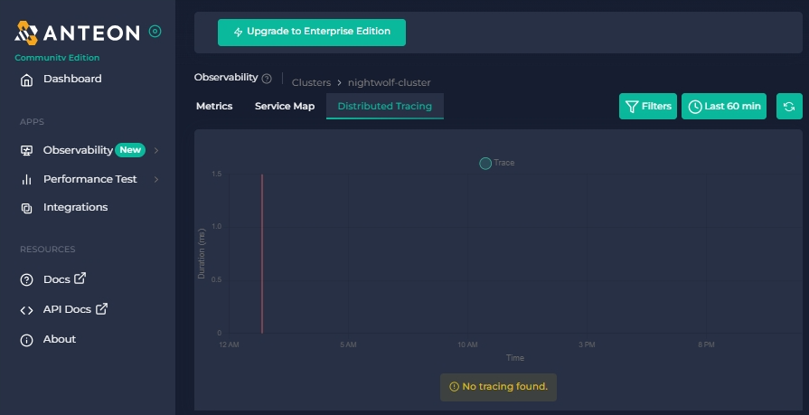
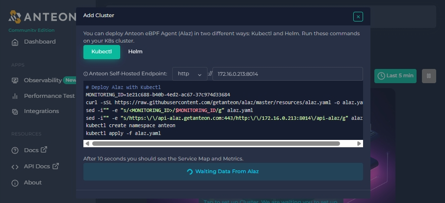
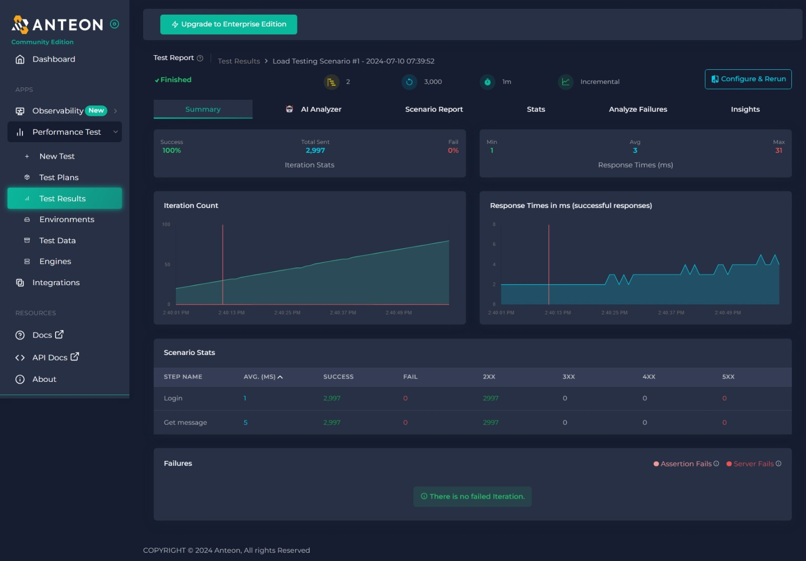

# [Anteon](https://getanteon.com/)

With a 1-minute setup, we automate the collection of metrics, logs, and traces, freeing you to focus on boosting your operations and development.

* Another no-code observability tool designed specifically for Kubernetes.

## Issue: `Anteon` Dashboard Shows 'No tracing found.'



**Note:** Anteon Server run on docker compose. I used the [Quick Start (docker compose)](https://github.com/getanteon/anteon/tree/master/selfhosted#%EF%B8%8F-quick-start-docker-compose). Everything seems to be running.

Here are the running containers:

```
$ docker ps
CONTAINER ID   IMAGE                                    COMMAND                  CREATED          STATUS          PORTS                                                                                                                                  NAMES
0b621f69954b   nginx:1.25.5-alpine                      "/docker-entrypoint.…"   57 minutes ago   Up 57 minutes   0.0.0.0:8014->80/tcp, :::8014->80/tcp                                                                                                  selfhosted-nginx-1b-1
c3bef2caec56   ddosify/selfhosted_alaz_backend:2.2.2    "/workspace/start_sc…"   57 minutes ago   Up 57 minutes                                                                                                                                          selfhosted-alaz-backend-celery-beat-1
66bfe539c0e1   ddosify/selfhosted_alaz_backend:2.2.2    "/workspace/start_sc…"   57 minutes ago   Up 56 minutes                                                                                                                                          selfhosted-alaz-backend-celery-worker-1-1
99b80d97792d   ddosify/selfhosted_alaz_backend:2.2.2    "/workspace/start_sc…"   57 minutes ago   Up 56 minutes                                                                                                                                          selfhosted-alaz-backend-celery-worker-2-1
c40c5015a9d4   ddosify/selfhosted_hammer:2.0.0          "hammer"                 57 minutes ago   Up 57 minutes                                                                                                                                          selfhosted-hammerdebug-1
a156ff56c815   ddosify/selfhosted_hammermanager:2.0.2   "/workspace/start_sc…"   57 minutes ago   Up 57 minutes                                                                                                                                          selfhosted-hammermanager-celery-beat-1
11bb67b0a751   ddosify/selfhosted_hammermanager:2.0.2   "/workspace/start_sc…"   57 minutes ago   Up 56 minutes                                                                                                                                          selfhosted-hammermanager-celery-worker-1
fab0f657c52e   ddosify/selfhosted_hammer:2.0.0          "hammer"                 57 minutes ago   Up 57 minutes                                                                                                                                          selfhosted-hammer-1
e9fb6457669d   ddosify/selfhosted_frontend:3.3.0        "/docker-entrypoint.…"   57 minutes ago   Up 57 minutes   80/tcp                                                                                                                                 selfhosted-frontend-1
06b9f928fd8b   ddosify/selfhosted_backend:3.2.5         "/workspace/start_sc…"   57 minutes ago   Up 57 minutes                                                                                                                                          selfhosted-backend-celery-beat-1
8329e4de59b5   ddosify/selfhosted_backend:3.2.5         "/workspace/start_sc…"   57 minutes ago   Up 56 minutes                                                                                                                                          selfhosted-backend-celery-worker-1
38ba708ef467   ddosify/selfhosted_alaz_backend:2.2.2    "/workspace/start_sc…"   57 minutes ago   Up 57 minutes   0.0.0.0:8009->8008/tcp, :::8009->8008/tcp                                                                                              selfhosted-alaz-backend-1
06ff1b20b40a   ddosify/selfhosted_hammermanager:2.0.2   "/workspace/start_sc…"   57 minutes ago   Up 57 minutes   0.0.0.0:9901->8001/tcp, :::9901->8001/tcp                                                                                              selfhosted-hammermanager-1
a123314230d6   ddosify/selfhosted_backend:3.2.5         "/workspace/start_sc…"   57 minutes ago   Up 57 minutes   0.0.0.0:8008->8008/tcp, :::8008->8008/tcp                                                                                              selfhosted-backend-1
6cc8885537d0   prom/prometheus:v2.37.9                  "/bin/prometheus --c…"   57 minutes ago   Up 57 minutes   0.0.0.0:9090->9090/tcp, :::9090->9090/tcp                                                                                              selfhosted-prometheus-1
b43b82a925c6   postgres:16.2-alpine                     "docker-entrypoint.s…"   57 minutes ago   Up 57 minutes   5432/tcp                                                                                                                               selfhosted-postgres-1
9b668162a302   redis:7.2.4-alpine                       "docker-entrypoint.s…"   57 minutes ago   Up 57 minutes   6379/tcp                                                                                                                               selfhosted-redis-alaz-backend-1
5bec052f5bda   rabbitmq:3.13.1-alpine                   "docker-entrypoint.s…"   57 minutes ago   Up 57 minutes   4369/tcp, 5671/tcp, 15691-15692/tcp, 25672/tcp, 0.0.0.0:6672->5672/tcp, :::6672->5672/tcp                                              selfhosted-rabbitmq-1
b4cb2a68d27f   influxdb:2.6.1-alpine                    "/entrypoint.sh infl…"   57 minutes ago   Up 57 minutes   0.0.0.0:9086->8086/tcp, :::9086->8086/tcp                                                                                              selfhosted-influxdb-1
3aad32c52c53   redis:7.2.4-alpine                       "docker-entrypoint.s…"   57 minutes ago   Up 57 minutes   6379/tcp                                                                                                                               selfhosted-redis-backend-1
1081c8cffdc3   chrislusf/seaweedfs:3.64                 "/entrypoint.sh serv…"   57 minutes ago   Up 57 minutes   7333/tcp, 8080/tcp, 8888/tcp, 9333/tcp, 18080/tcp, 18888/tcp, 19333/tcp, 0.0.0.0:8333->8333/tcp, :::8333->8333/tcp                     selfhosted-seaweedfs-1
```

Then, I installed the agent to kubernetes:



Unfortunately, the dashboard shows 'No tracing found.'

### Troubleshooting Steps

1. **Check if all Pods are running normally:**
   - All containers seems running as shown above.

2. **Check the error logs:**
   - I have verified the logs, and there are no interesting error logs to investigate. Logs [here](assets/last-few-lines-anteon-errors.log).

I am still unsure where the failure occurs.

---

## Experience

The installation process for Anteon is very straightforward, and the anteon-ui is intuitive. You can have it up and running in minutes.

Since I can't test their observability tools, I tried their performance testing platform. It offers:

- **No-code UI**
- **Scenario testing**: Perform tests in sequence to simulate real user scenarios.
- **Save test configurations**: You can reuse configurations for future tests, just click-and-click, and you are ready to re-run the tests.
- **Support for Postman collections**: Import a Postman collection to automatically configure the testing plan.
- **Distributed testing (Freemium feature)**: Obtain a license key by registering on their cloud platform.


