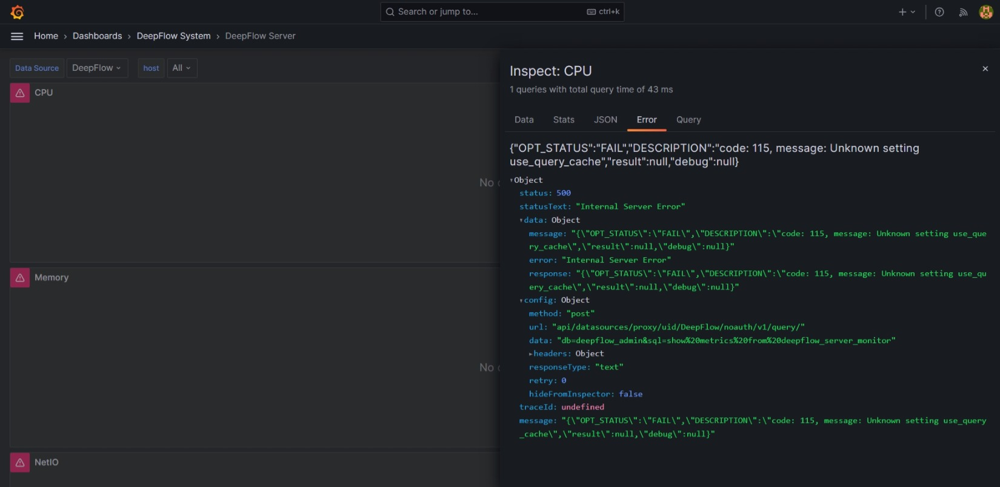

# [Deepflow](https://deepflow.io)

✨ Zero-code distributed tracing and profiling with eBPF 🚀

* I found this tool on the recommendation of some speakers at a cloud native kubernetes meetup.

## Issue: Grafana Dashboard Not Displaying Data

**Note:** DeepFlow Server must run on Kubernetes (K8s). However, for a simple exploration, I used the [All-in-one quick deployment with Docker Compose](https://www.deepflow.io/docs/ce-install/all-in-one/#deploying-with-docker-compose) for the DeepFlow server installation and followed the instructions for [Monitoring a legacy server](https://www.deepflow.io/docs/ce-install/legacy-host/) for the DeepFlow agent installation. Everything appears to be running.

Here are the running containers:

```
CONTAINER ID   IMAGE                                                                       COMMAND                  CREATED         STATUS         PORTS
b8ef871c4b7f   ghcr.io/deepflowio/deepflow-ce/deepflow-agent:v6.5                          "/bin/deepflow-agent…"   2 minutes ago   Up 2 minutes
                                                 deepflow-agent
9c52c995e4b1   registry.cn-hongkong.aliyuncs.com/deepflow-ce/deepflow-server:v6.5.9        "/bin/sh -c /bin/dee…"   2 hours ago     Up 2 hours     0.0.0.0:20416->20416/tcp, :::20416->20416/tcp, 0.0.0.0:20419->20419/tcp, :::20419->20419/tcp, 0.0.0.0:30033->20033/tcp, :::30033->20033/tcp, 0.0.0.0:30035->20035/tcp, :::30035->20035/tcp, 0.0.0.0:30417->20417/tcp, :::30417->20417/tcp
                                                 deepflow-server
87859ca9812e   registry.cn-hongkong.aliyuncs.com/deepflow-ce/grafana:10.1.5                "/run.sh"                2 hours ago     Up 2 hours     0.0.0.0:3000->3000/tcp, :::3000->3000/tcp
                                                 deepflow-grafana
ec35db6d2445   registry.cn-hongkong.aliyuncs.com/deepflow-ce/clickhouse-server:22.8.6.71   "/entrypoint.sh"         2 hours ago     Up 2 hours     8123/tcp, 9000/tcp, 9009/tcp
                                                 deepflow-clickhouse
6f52e33a6a73   registry.cn-hongkong.aliyuncs.com/deepflow-ce/deepflow-app:v6.5.9           "/bin/sh -c 'python3…"   2 hours ago     Up 2 hours     0.0.0.0:20418->20418/tcp, :::20418->20418/tcp
                                                 deepflow-app
5cd07f00cad6   registry.cn-hongkong.aliyuncs.com/deepflow-ce/mysql:8.0.31                  "docker-entrypoint.s…"   2 hours ago     Up 2 hours     3306/tcp, 33060/tcp
                                                 deepflow-mysql
```

Unfortunately, I see nothing on the Grafana dashboard.



### Troubleshooting Steps

According to the [FAQ](https://www.deepflow.io/docs/diagnose/FAQ/), if there is no data on Grafana after deployment:

1. **Check if all Pods are running normally:** Execute `kubectl get pods -n deepflow` and confirm that all Pods are in the Running state.
   - *Note:* I am using Docker Compose, not Kubernetes. All containers are running as shown above.

2. **Check the connection between DeepFlow Agent and DeepFlow Server:**
   - Verify if the service domain has been successfully created using `deepflow-ctl domain list`.
   - Check if the `STATE` is `NORMAL` using `deepflow-ctl agent list`.
   - I have verified whether the deepflow-agent running or not, it don't change the state, only `NORMAL`.

I am still unsure where the failure occurs.

---

As DeepFlow continues to translate their documentation from Chinese, I hope future versions will provide clearer installation guide & explanations.
