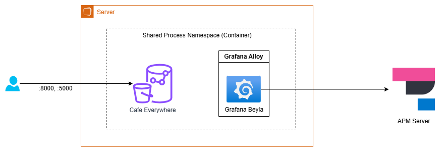
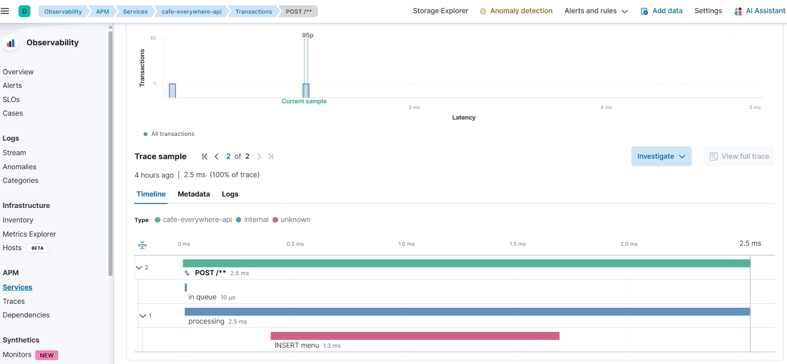

# [Grafana Beyla](https://github.com/grafana/beyla)

eBPF-based autoinstrumentation for web applications and network metrics.

* Grafana Beyla is an interesting tool I found at January 13, 2024. Unlike many similar tools, Beyla can run on a single VM without the need for Kubernetes.

## Application Example

I used [Cafe Everywhere](https://github.com/michaelact/cafe-everywhere) as the target application to export traces. Here is a simple overview of how this application runs with Grafana beyla:



## How to Run Grafana Beyla

### Prerequisites

Ensure you have the following installed on your system:

- [Rancher Desktop](https://rancherdesktop.io/) or [Docker](https://docs.docker.com/engine/install/)
- [Elastic APM](https://www.elastic.co/guide/en/observability/current/apm-installing.html) or [Jaeger APM](https://www.jaegertracing.io/docs/1.58/getting-started/)

### Setup Steps

1. **Navigate to the directory:**
   ```shell
   cd tools/grafana-beyla/
   ```

2. Setup `.env` file
   - `HOSTNAME`
   - `OTEL_EXPORTER_OTLPHTTP_ENDPOINT`: APM server endpoint.
   - `OTEL_EXPORTER_OTLPHTTP_AUTHORIZATION_HEADER`: APM `authorization` HTTP header value
   - `OTEL_EXPORTER_PORTS`: What port do your application runs? If there are multiple ports, you can separate them with commas.
   - `OTEL_EXPORTER_SERVICE_NAME`

3. **Start the application:**
   ```shell
   docker compose up -d
   ```

4. **Verify it's running on the APM dashboard.**

In my case, I use the Elastic Cloud APM server.



## Conclusion

Grafana Beyla currently meets my needs for a no-code observability tool that can be installed on a single server with Docker Compose.

## Next Steps

1. Can it trace Elasticsearch queries?
2. How deep can the tool trace, such as function calls?
