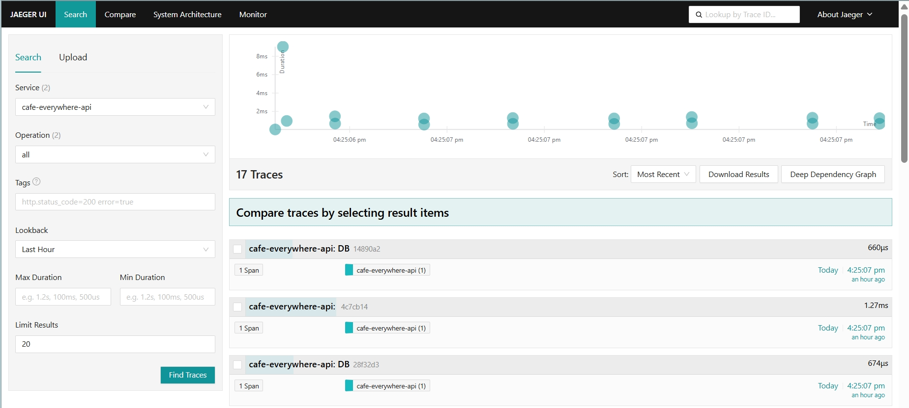
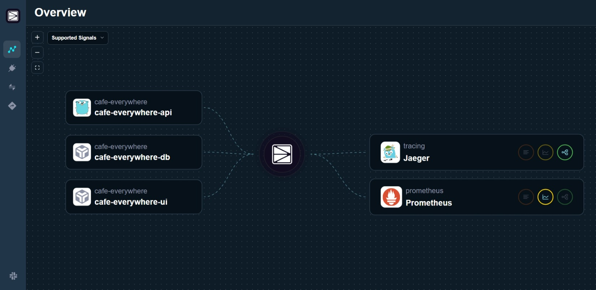

# [Odigos](https://odigos.io/)

Simplify OpenTelemetry complexity and eliminate performance overhead with the only platform that can generate distributed tracing across all your applications without code changes.

* Another no-code application observability tools for kubernetes.

## Application Example

I used [Cafe Everywhere](https://github.com/michaelact/cafe-everywhere) as the target application to export traces.

## How to Run Odigos

### Prerequisites

Ensure you have the following installed on your system:

- [Rancher Desktop](https://rancherdesktop.io/) or [Docker](https://docs.docker.com/engine/install/)

### Setup Steps

Follows https://docs.odigos.io/quickstart/introduction .

Verify if it's running on the APM dashboard.

## Conclusion

- One thing I noticed is that Odigos can identify the programming language of `cafe-everywhere-api`, which is something Grafana Beyla does not do.
- The installation process for Odigos is very straightforward, and the `odigos-ui` is intuitive. You can have it up and running in minutes.

## Next Steps

1. Can it trace Elasticsearch queries?
2. How deep can the tool trace, such as function calls?
