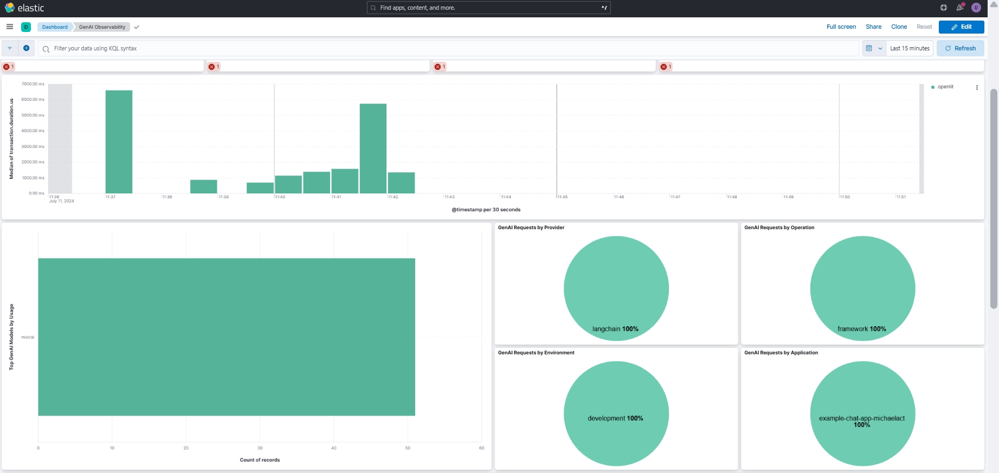

# [Openlit](https://openlit.io/)

OpenTelemetry-native GenAI & LLM Application Observability Tool

* Openlit is an interesting tool that stands out as the first I’ve seen to monitor GenAI and LLM applications with just a single line of code. When I say no-code, it doesn’t mean no code at all, but if it’s just a single line of code, it can still be considered no-code.

## Setup

Follow the [Getting Started Guide](https://github.com/openlit/openlit?tab=readme-ov-file#step-1-deploy-openlit-stack) to integrate with Openlit stack.

## Experience

- I tried it with Langchain and Ollama, and it works. However, the total usage tokens and successful requests do not show up. Please check the [example-ollama-app](./example-ollama-app).

## Limitations

- It doesn't work for huggingface text-generation-inference API + langchain, or I may have implemented it incorrectly. Please check the [example-customllm-app](./example-customllm-app) where this tool communicates with a custom LLM URL using Langchain.
