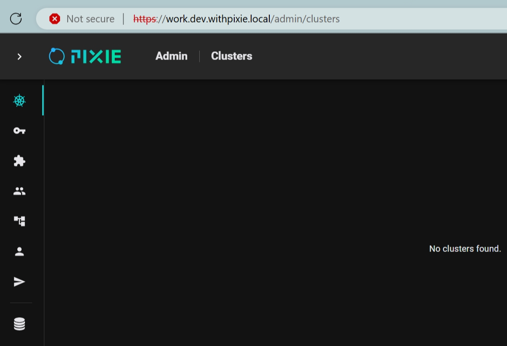

# [Pixie](https://docs.px.dev/)

Instant open-source debugging for your applications on Kubernetes.

* Another no-code observability tool designed specifically for Kubernetes.

## Issue: Pixie Dashboard Shows 'No clusters found.'



**Note:** Pixie Server must run on Kubernetes (K8s). I used the [Self-Hosted Deployment](https://docs.px.dev/installing-pixie/install-guides/self-hosted-pixie/) for the Pixie installation and deployed it on AWS EKS. Everything seems to be running.

Here are the running containers:

```
$ kubectl get pods -n plc --watch
NAME                                       READY   STATUS    RESTARTS      AGE
api-server-6cd468c58c-gbhzn                1/1     Running   0             118s
artifact-tracker-server-847f94fb4c-fdx7t   1/1     Running   0             118s
auth-server-849dcf659b-4v5ps               1/1     Running   0             118s
cloud-proxy-7cd458bf59-64bjb               2/2     Running   0             118s
config-manager-server-85bb76c886-qpgb9     1/1     Running   0             118s
cron-script-server-594d97446-w8fpv         1/1     Running   0             118s
hydra-68459766bc-qzvkt                     2/2     Running   0             87s
indexer-server-5f6ddd6dfb-7vcpz            1/1     Running   3 (57s ago)   118s
kratos-6895f5648-pk5dh                     2/2     Running   0             87s
metrics-server-696556787c-vg97d            1/1     Running   0             118s
pl-elastic-es-data-0                       1/1     Running   0             47m
pl-elastic-es-master-0                     1/1     Running   0             41m
pl-elastic-es-master-1                     1/1     Running   0             43m
pl-nats-0                                  0/1     Pending   0             79s
pl-nats-1                                  1/1     Running   0             100s
pl-nats-2                                  1/1     Running   0             2m
plugin-server-bc464c8b6-qbtvv              1/1     Running   0             117s
postgres-548d9fc947-xb9zh                  1/1     Running   1 (56s ago)   117s
profile-server-77699748b7-vkqc6            1/1     Running   0             117s
project-manager-server-579845fffd-qjh5c    1/1     Running   0             117s
scriptmgr-server-55879469cf-d9llz          1/1     Running   0             117s
vzconn-server-667ccd9766-tlb2f             1/1     Running   2 (99s ago)   116s
vzmgr-server-55fbc86459-9wvdx              1/1     Running   0             116s
```

Unfortunately, the dashboard shows 'No clusters found.'

### Troubleshooting Steps

1. **Check if all Pods are running normally:**
   - All pods seems running as shown above.

2. **Check the error logs:**
   - I have verified the logs, and there are no interesting error logs to investigate. Logs [here](assets/last-few-lines-pixie-namespace-errors.log).

I am still unsure where the failure occurs.

---

## Suggestions

- **Simplify Self-Hosted Deployment:**
  - Default installation to plain HTTP without requiring external HTTPS and domain configurations. Users should have the option to add HTTPS if needed.
  - Ensuring pixie can run on top of a simple kubernetes cluster.
- **Add a Troubleshooting Guide:** A detailed troubleshooting guide would be beneficial for resolving common issues.

Since this is a community project, I hope I can try it more in my free time and contributes.
